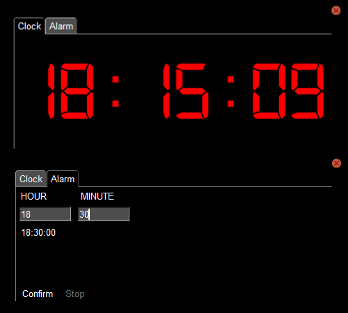

## **Alarm Clock**

Welcome to the Alarm Clock application. This program is designed to help you wake up on time and start your day off right. With its intuitive interface and customizable features, it's the perfect tool for anyone who struggles to get out of bed in the morning.

Featuring a digital clock display and an easy-to-use alarm setting, this application allows you to set your wake-up time and customize your alarm sound. You can also add multiple alarms.

I'm constantly working to improve and update my applications, and welcome any feedback or suggestions you may have. So, give it a try and let me know what you think!

## **Features**

*   Add multiple alarms
*   Stop individual alarms
*   GUI interface

## Getting Started

These instructions will get you a copy of the project up and running on your local machine for development and testing purposes or just for pure fun.

## Prerequisites

*   You will need Python 3 installed on your system: [https://www.python.org/](https://www.python.org/)
*   You will also need to install the required libraries:  
    `pip install pysimplegui`
*   Alternatively, run this command for automatic module installation:  
    `pip install -r requirements.txt`
*   You will need the `digital-7 (mono).ttf` font, which can be found in the main folder.

## Installing

Clone the repository:  
`$ git clone https://github.com/paichiwo/Alarm_Clock.git`  
`$ cd Alarm_Clock`  
`$ .\Alarm_Clock.py`

## **Usage**

The main window of the application has two tabs: "Clock" and "Alarm". The "Clock" tab displays the current time, while the "Alarm" tab allows you to add new alarms.

To add a new alarm:

*   Switch to the "Alarm" tab
*   Enter the desired hour and minute for the alarm in the respective input fields
*   Click the "Confirm" button

To stop a currently playing alarm:

*   Click the "Stop" button

## **Customization**

`psg.theme` can be changed to any desired color. [List of themes](https://media.geeksforgeeks.org/wp-content/uploads/20200511200254/f19.jpg).

## **Contributing**

Contributions are always welcome and appreciated! If you find any issues or have suggestions for improvements, please feel free to open an issue or pull request on the GitHub repository.

To contribute, please follow these steps:

1.  Fork the repository to your own GitHub account.
2.  Clone the repository to your local machine.
3.  Create a new branch for your changes.
4.  Make your changes and commit them with clear commit messages.
5.  Push your changes to your forked repository.
6.  Open a pull request to the main repository.

Please ensure that your code is well-documented, tested, and follows the existing code style and guidelines. By contributing, you agree to release your code under the same MIT license as the original code.

## **Credits**

This application was built by [paichiwo](https://github.com/paichiwo).

## **License**

This project is licensed under the MIT License - see the LICENSE file for details.

## **Examples**
